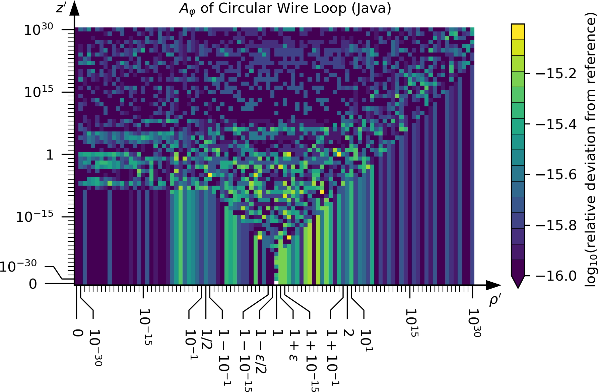
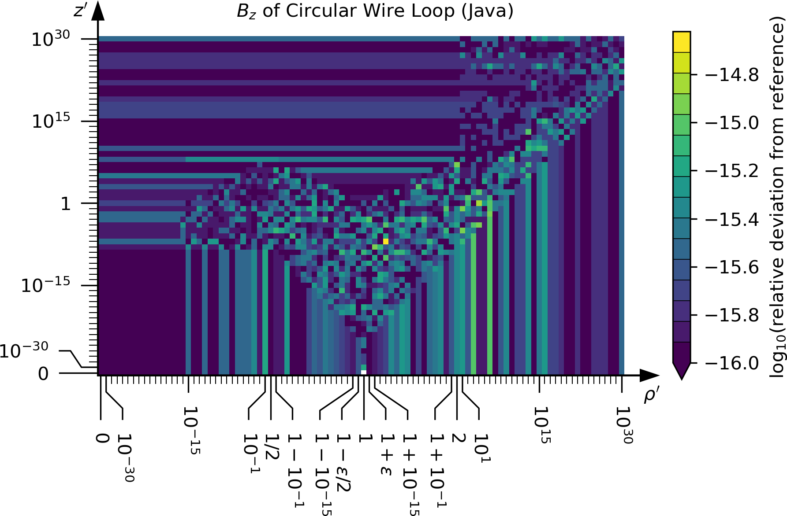

# abscab
Accurate Biot-Savart routines with Correct Asymptotic Behaviour

The main article on this software can be found here: [abscab_main.pdf](article/abscab_main.pdf)

## API

This library can be used to compute the magnetic field and the magnetic vector potential
of filamentary current carriers in the form of a circular loop and straight segments.
Arbitrary geometries of conductors can be approximated by a polygon along its contour
and the connecting segments between the polygon vertices are modeled by straight segments.
Finite-width conductors can be approximated by arranging multiple filaments
throughout the cross section of the current carrier.

The methods available to use this functionality are outlined below.
The API consists of two levels.
The high-level methods use the lower-level methods to evaluate
the magnetic field and magnetic vector potential for a given current
at given locations in global Cartesian coordinates.
The lower level consists of methods for computing the normalized
magnetic vector potential and magnetic field (i.e., only the geometric parts of the formulas)
in normalized coordinates relative to the current carriers.

### High-Level Methods
The high-level API constists of methods to compute
the magnetic field and the magnetic vector potential
of a polygon filament (current flows along straight wire segments from point to point along a polygon)
and a circular filament.

#### Polygon Filament
The polygon describing the current carrier geometry
is made up of the ordered list of points (vertices) along the polygon.
A positive value of the current implies
that the current flows along the polygon in the order of the points.
The first and the last point of the polygon must coincide
to model a closed loop.
At least two points must be specified, which are then taken
as start- and endpoint of a single straight wire segment.

The **geometry of the polygon** can be provided to the routines as an array.
 * **Java**: `double[][] vertices = new double[3][numVertices];`  
   The first dimension (3) is for the three components (x, y, z) of the Cartesian coordinates of the points.  
   The second dimension (`numVertices`) is for the individual points along the polygon.
 * **C**: `double vertices[3 * numVertices];`  
   The geometry of the polygon is specified as a one-dimensional array.  
   The order is (`x_0`, `y_0`, `z_0`, `x_1`, `y_1`, `z_1`, ..., `x_n`, `y_n`, `z_n`)
   where `n = numVertices - 1`.
 * **Fortran**: `real(wp), dimension(3, numVertices) :: vertices`  
   The first dimension (3) is for the three components (x, y, z) of the Cartesian coordinates of the points.  
   The second dimension (`numVertices`) is for the individual points along the polygon.
 * **Python**: `arr(float) vertices: [numVertices][3: x, y, z]`  
   The first dimension (`numVertices`) is for the individual points along the polygon.  
   The second dimension (3) is for the three components (x, y, z) of the Cartesian coordinates of the points.  

Furthermore, the geometry of the polygon can be provided via a callback function
providing the coordinates of the`i`-th point along the polygon when being called with the point index `i`.
This allows to compute the magnetic field and magnetic vector potential
of polygon geometries that consist of so many points that holding them in memory simultaneously
would not be possible.

The **evaluation locations** are provided to the routines as an array
similarly shaped to the ones providing the polygon geometry (see above).

An optional parameter `useCompensatedSummation` (`true` by default)
controls the use of Kahan-Babushka compensated summation when computing
the superposition of the fields from the individual wire segments along the polygon.
It can be set to `false` in order to use standard `+=` summation
into a single accumulation variable.
This might be faster in some cases at the cost of giving up guaranteed accuracy.

The parallelized polygon routines allow to specify an optional parameter
`numProcessors` specifying over how many threads the computation shall be parallelized.
The prallelization is performed over either the number of source terms
(number of wire segments along the polygon) or the number of evaluation locations, whichever is greater.
This is done to ensure parallelization over large chunks of computational work
for more efficient use of the processors.

The **magnetic vector potential of a polygon filament**
is computed using methods called `vectorPotentialPolygonFilament`.

The **magnetic field of a polygon filament**
is computed using methods called `magneticFieldPolygonFilament`.

A suffix `VertexSupplier` is appended to these names (in C, Fortran and Python)
to indicate the routines that accept a callback function for the polygon geometry.

#### Circular Filament

##### Magnetic Vector Potential (A)

##### Magnetic Field (B)

### Low-Level Methods

## Implementation

Various implementations are provided in this repository.
Here is an overview:

|   Language   |            main `abscab` file                                  |                unit tests                   | demo code | parallelized |
| ------------ | -------------------------------------------------------------- | ------------------------------------------- | --------- | ------------ |
| Java 8       | [`ABSCAB.java`](src/main/java/de/labathome/abscab/ABSCAB.java) | [`TestABSCAB.java`](src/test/java/de/labathome/abscab/TestABSCAB.java) | [`DemoABSCAB.java`](src/test/java/de/labathome/abscab/DemoABSCAB.java) | :heavy_check_mark: (threads) |
| C 99         | [`abscab.h`](src/main/c/abscab.h)                              | [`test_abscab.c`](src/test/c/test_abscab.c) | [`demo_abscab.c`](src/test/c/demo_abscab.c) | :heavy_check_mark: (OpenMP) |
| Fortran 2008 | [`abscab.f08`](src/main/fortran/abscab.f08)                    | [`test_abscab.f08`](src/test/fortran/test_abscab.f08) | [`demo_abscab.f08`](src/test/fortran/demo_abscab.f08) | :heavy_check_mark: (OpenMP) |
| Python 3     | [`abscab.py`](src/main/python/abscab/_abscab.py)                | [`test_abscab.py`](src/test/python/abscab/test_abscab.py) | [`demo_abscab.py`](src/test/python/abscab/demo_abscab.py)  | :heavy_multiplication_x: |

## Reference Outputs

## Verification Procedure

### `mpmath` vs. Mathematica

First, the reference implementation using `mpmath` is verified against
an implementation in Mathematica.
For brevity, this is done on a reduced set of test points.

### Test Points
A set of test points is defined at which the implementations
will be tested against the arbitrary-precision reference will be tested.
These points are computed in Java, since it is a strictly-typed language
and binaries are expected to given platform-independent results.
Nevertheless they are still of finite (64-bit) precision.
The code to generate the test points is [`src/test/java/GenerateTestKnots.java`](src/test/java/de/labathome/GenerateTestKnots.java).

The test points are saved into text files in [`src/test/resources`](src/test/resources):
* [`testPointsRpStraightWireSegment.dat`](src/test/resources/testPointsRpStraightWireSegment.dat) contains the value of `r'` at which
  the straight wire segment methods are tested.
* [`testPointsZpStraightWireSegment.dat`](src/test/resources/testPointsZpStraightWireSegment.dat) contains the value of `z'` at which
  the straight wire segment methods are tested.
* [`testPointsRpCircularWireLoop.dat`](src/test/resources/testPointsRpCircularWireLoop.dat) contains the value of `r'` at which
  the circular wire loop methods are tested.
* [`testPointsZpCircularWireLoop.dat`](src/test/resources/testPointsZpCircularWireLoop.dat) contains the value of `z'` at which
  the circular wire loop methods are tested.

Those above files are only provided to have a human-readable equivalent
of the set of test points.
The actual test point data read by the arbitrary-precision software
is in [`testPointsStraightWireSegment.dat`](src/test/resources/testPointsStraightWireSegment.dat) for the straight wire segment
and in [`testPointsCircularWireLoop.dat`](src/test/resources/testPointsCircularWireLoop.dat) for the circular wire loop.

### Reference Data
The reference data (`A_z` and `B_phi` for a straight wire segment;
`A_phi`, `B_rho` and `B_z` for a circular wire loop) is also available in the folder
[`src/test/resources`](src/test/resources):
* [`refDataStraightWireSegment.dat`](src/test/resources/refDataStraightWireSegment.dat) was generated by [`computeReferenceStraightWireSegment.py`](src/test/python/computeReferenceStraightWireSegment.py) and contains the quantities `A_z` and `B_phi`
  for a straight wire segment at all test points.
* [`refDataCircularWireLoop.dat`](src/test/resources/refDataCircularWireLoop.dat) was generated by [`computeReferenceCircularWireLoop.py`](src/test/python/computeReferenceCircularWireLoop.py) and contains the quantities `A_phi`, `B_rho` and `B_z`
  for a circular wire loop at all test points.
