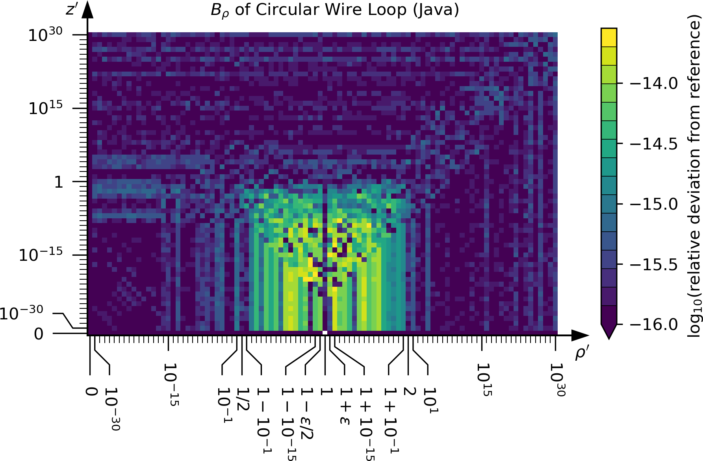

# Accurate Biot-Savart routines with Correct Asymptotic Behaviour


This library can be used to compute the magnetic field and the magnetic vector potential
of filamentary current carriers in the form of a circular loop and straight segments.
Arbitrary geometries of conductors can be approximated by a polygon along its contour
and the connecting segments between the polygon vertices are modeled by straight segments.
Finite-width conductors can be approximated by arranging multiple filaments
throughout the cross section of the current carrier.

Please consider leaving a GitHub star if you like this software.

If you use this software for scientific work,
we kindly ask you to cite [the corresponding article](https://doi.org/10.1016/j.cpc.2023.108692):
```bibtex
@article{abscab_2023,
  title  = {{Biot-Savart routines with minimal floating point error}},
  author = {Jonathan Schilling and Jakob Svensson and Udo Höfel and Joachim Geiger and Henning Thomsen},
  journal = {Computer Physics Communications},
  pages = {108692},
  year = {2023},
  issn = {0010-4655},
  doi = {10.1016/j.cpc.2023.108692}
}
```

## Table of Contents
1. [Implementations](https://github.com/jonathanschilling/abscab#implementations)
2. [API](https://github.com/jonathanschilling/abscab#api)
   1. [High-Level Methods](https://github.com/jonathanschilling/abscab#high-level-methods)
      1. [Polygon Filament](https://github.com/jonathanschilling/abscab#polygon-filament)
      2. [Circular Filament](https://github.com/jonathanschilling/abscab#circular-filament)
   2. [Low-Level Methods](https://github.com/jonathanschilling/abscab#low-level-methods)
      1. [Straight Wire Segment](https://github.com/jonathanschilling/abscab#straight-wire-segment)
      2. [Circular Wire Loop](https://github.com/jonathanschilling/abscab#circular-wire-loop)
3. [Reference Outputs](https://github.com/jonathanschilling/abscab#reference-outputs)
4. [Verification Procedure](https://github.com/jonathanschilling/abscab#verification-procedure)
   1. [`mpmath` vs. Mathematica](https://github.com/jonathanschilling/abscab#mpmath-vs-mathematica)
   2. [Test Points](https://github.com/jonathanschilling/abscab#test-points)
   3. [Reference Data](https://github.com/jonathanschilling/abscab#reference-data)

## Implementations

Various implementations are provided in this repository.
Here is an overview:

|   Language   |            main `abscab` file                                  |                unit tests                   | demo code | parallelized |
| ------------ | -------------------------------------------------------------- | ------------------------------------------- | --------- | ------------ |
| [Java 8](https://github.com/jonathanschilling/abscab-java) | [`ABSCAB.java`](https://github.com/jonathanschilling/abscab-java/blob/master/src/main/java/de/labathome/abscab/ABSCAB.java) | [`TestABSCAB.java`](https://github.com/jonathanschilling/abscab-java/blob/master/src/test/java/de/labathome/abscab/TestABSCAB.java) | [`DemoABSCAB.java`](https://github.com/jonathanschilling/abscab-java/blob/master/src/test/java/de/labathome/abscab/DemoABSCAB.java) | :heavy_check_mark: (threads) |
| C 99         | [`abscab.h`](src/main/c/abscab.h)                              | [`test_abscab.c`](src/test/c/test_abscab.c) | [`demo_abscab.c`](src/test/c/demo_abscab.c) | :heavy_check_mark: (OpenMP) |
| Fortran 2008 | [`abscab.f08`](src/main/fortran/abscab.f08)                    | [`test_abscab.f08`](src/test/fortran/test_abscab.f08) | [`demo_abscab.f08`](src/test/fortran/demo_abscab.f08) | :heavy_check_mark: (OpenMP) |
| Python 3     | [`abscab.py`](src/main/python/abscab/_abscab.py)                | [`test_abscab.py`](src/test/python/abscab/test_abscab.py) | [`demo_abscab.py`](src/test/python/abscab/demo_abscab.py)  | :heavy_multiplication_x: |

## API

The API consists of two levels.
The high-level methods use the lower-level methods to evaluate
the magnetic field and magnetic vector potential for a given current
at given locations in global Cartesian coordinates.
The lower level consists of methods for computing the normalized
magnetic vector potential and magnetic field (i.e., only the geometric parts of the formulas)
in normalized coordinates relative to the current carriers.

### High-Level Methods
The high-level API constists of methods to compute
the magnetic field and the magnetic vector potential
of a polygon filament (current flows along straight wire segments from point to point along a polygon)
and a circular filament.

**SI Units** are implied in the high-level interface.
The geometric quantites are assumed to be specified in meters (m)
and the current to be specified in Amperes (A).
Then, the magnetic field is returned in Tesla (T) and the magnetic vector potential is returned in Tesla * meter (Tm).

#### Polygon Filament
The polygon describing the current carrier geometry
is made up of the ordered list of points (vertices) along the polygon.
A positive value of the current implies
that the current flows along the polygon in the order of the points.
The first and the last point of the polygon must coincide
to model a closed loop.
At least two points must be specified, which are then taken
as start- and endpoint of a single straight wire segment.

The **geometry of the polygon** can be provided to the routines as an array.
 * **Java**: `double[][] vertices = new double[3][numVertices];`  
   The first dimension (3) is for the three components (x, y, z) of the Cartesian coordinates of the points.  
   The second dimension (`numVertices`) is for the individual points along the polygon.
 * **C**: `double vertices[3 * numVertices];`  
   The geometry of the polygon is specified as a one-dimensional array.  
   The order is (`x_0`, `y_0`, `z_0`, `x_1`, `y_1`, `z_1`, ..., `x_n`, `y_n`, `z_n`)
   where `n = numVertices - 1`.
 * **Fortran**: `real(wp), dimension(3, numVertices) :: vertices`  
   The first dimension (3) is for the three components (x, y, z) of the Cartesian coordinates of the points.  
   The second dimension (`numVertices`) is for the individual points along the polygon.
 * **Python**: `arr(float) vertices: [numVertices][3: x, y, z]`  
   The first dimension (`numVertices`) is for the individual points along the polygon.  
   The second dimension (3) is for the three components (x, y, z) of the Cartesian coordinates of the points.  

The **evaluation locations** are provided to the routines as an array
similarly shaped to the ones providing the polygon geometry (see above).

An optional parameter `useCompensatedSummation` (`true` by default)
controls the use of Kahan-Babushka compensated summation when computing
the superposition of the fields from the individual wire segments along the polygon.
It can be set to `false` in order to use standard `+=` summation
into a single accumulation variable.
This might be faster in some cases at the cost of giving up guaranteed accuracy.

The parallelized polygon routines allow to specify an optional parameter
`numProcessors` specifying over how many threads the computation shall be parallelized.
The parallelization is performed over either the number of source terms
(number of wire segments along the polygon) or the number of evaluation locations, whichever is greater.
This is done to ensure parallelization over as large chunks of computational work as possible
for the most efficient use of available processors.

The **magnetic vector potential of a polygon filament**
is computed using methods called `vectorPotentialPolygonFilament`.

The **magnetic field of a polygon filament**
is computed using methods called `magneticFieldPolygonFilament`.

Furthermore, the geometry of the polygon can be provided via a callback function
providing the coordinates of the `i`-th point along the polygon when being called with the point index `i`.
This allows to compute the magnetic field and magnetic vector potential
of polygon geometries that consist of so many points that holding them in memory simultaneously
would not be possible.
A suffix `VertexSupplier` is appended to these names (in C, Fortran and Python)
to indicate the routines that accept a callback function for the polygon geometry.

#### Circular Filament
The geometry of a current-carrying circular loop
is described in terms of the origin of the loop,
a normal vector and the radius of the loop.

The **origin** is a three-element vector
which contains the Cartesian coordinates (`x_0`, `y_0`, `z_0`) of the center point of the loop in global coordinates.

The **normal** vector is a three-element vector
which contains the Cartesian components (`n_x`, `n_y`, `n_z`) of a vector normal to the plane of the wire loop.

The **radius** of the loop completes the specification of the loop geometry.

A positive current implies that the current flows in clockwise direction
along the wire loop when looking in positive direction along the normal vector.
This is the usual direction of the tangential unit vector (`e_phi`) in a cylindrical coordinate system
that has its z-axis aligned with the normal vector of the loop.

One call to the methods for the circular filament
compute the magnetic field and magnetic vector potential
at a number of evaluation locations due to the current in a single wire loop.
Thus, for computing the magnetostatic quantities of a multi-winding coil,
multiple calls (one for each winding of the coil) have to me made
and the results need to be superposed to get the total fields of the coil.

The **evaluation locations** must be provided to the routines as an array.
 * **Java**: `double[][] evalPos = new double[3][numEvalPos];`  
   The first dimension (3) is for the three components (x, y, z) of the Cartesian coordinates of the locations.  
   The second dimension (`numEvalPos`) is for the individual evaluation locations.
 * **C**: `double evalPos[3 * numEvalPos];`  
   The evaluation locations are specified as a one-dimensional array.  
   The order is (`x_0`, `y_0`, `z_0`, `x_1`, `y_1`, `z_1`, ..., `x_n`, `y_n`, `z_n`)
   where `n = numEvalPos - 1`.
 * **Fortran**: `real(wp), dimension(3, numEvalPos) :: evalPos`  
   The first dimension (3) is for the three components (x, y, z) of the Cartesian coordinates of the locations.  
   The second dimension (`numEvalPos`) is for the individual evaluation locations.
 * **Python**: `arr(float) evalPos: [numEvalPos][3: x, y, z]`  
   The first dimension (`numEvalPos`) is for the individual evaluation locations.
   The second dimension (3) is for the three components (x, y, z) of the Cartesian coordinates of the locations.  

The **magnetic vector potential of a circular filament**
is computed using methods called `vectorPotentialCircularFilament`.

The **magnetic field of a circular filament**
is computed using methods called `magneticFieldCircularFilament`.

### Low-Level Methods
The low-level methods of this library are used to compute
the geometric parts of the formulas for the magnetic vector potential
and magnetic field of a straight wire segment and a circular wire loop.
Normalized coordinates are used in a cylindrical coordinate system
aligned with the axis of the wire segment in case of a straight wire segment
and with the axis of the wire loop in the respective case
of computing magnetostatic quantities for a circular wire loop.

Arguments to the routines listed below are `rhoP` and `zP`
for the normalized radial and normalized vertical coordinates
of the evaluation location, respectively.

Inside these routines, appropriate special-case formulations are used
for given normalized coordinates of the evaluation location
in order to maximize accuracy of the results.

#### Straight Wire Segment
The normalization factor used for the evaluation location
in this case is the length `L` of wire segment.

The **normalized magnetic vector potential** of a straight wire segment
only has a component `A_z` in the axial direction.
This component is computed using routines named `straightWireSegment_A_z(rhoP, zP)`.
The return value of this method has to be multiplied by `mu_0 * I / (2 * pi)`
to get the magnetic vector potential in units of `Tm`, where
`mu_0` is the vacuum magnetic permeability and
`I` is the current along the wire segment.

The **normalized magnetic field** of a straight wire segment
only has a component `B_phi` in the tangential/cylindrical direction around the wire segment.
This component is computed using routines named `straightWireSegment_B_phi(rhoP, zP)`.
The return value of this methods has to multiplied by `mu_0 * I / (4 * pi * L)`
to get the magnetic field in units of `T`, where
`mu_0` is the vacuum magnetic permeability,
`I` is the current along the wire segment and
`L` is the length of the wire segment.

#### Circular Wire Loop
The normalization factor used for the evaluation location
in this case is the radius `r` of wire loop.

The **normalized magnetic vector potential** of a circular wire loop
only has a component `A_phi` in the tangential/cylindrical direction of the wire loop.
This component is computed using routines named `circularWireLoop_A_phi(rhoP, zP)`.
The return value of this methods has to multiplied by `mu_0 * I / pi`
to get the magnetic vector potential in units of `Tm`, where
`mu_0` is the vacuum magnetic permeability and
`I` is the current along the wire loop.

The **normalized magnetic field** of a circular wire loop
has components `B_rho` and `B_z` in radial and vertical directions, respectively.
The component `B_rho` is computed using routines named `circularWireLoop_B_rho(rhoP, zP)`.
The component `B_z` is computed using routines named `circularWireLoop_B_z(rhoP, zP)`.
The return values of these methods have to be multiplied by `mu_0 * I / (pi * r)`
to get the magnetic field in units of `T`, where
`mu_0` is the vacuum magnetic permeability,
`I` is the current along the wire loop and
`r` is the radius of the wire loop.

## Reference Outputs
The following plots show the agreement between the Java implementation
and the reference data computed using arbitrary-precision arithmetic.





## Verification Procedure

### `mpmath` vs. Mathematica

First, the reference implementation using `mpmath` is verified against
an implementation in Mathematica.
For brevity, this is done on a reduced set of test points.

### Test Points
A set of test points is defined at which the implementations
will be tested against the arbitrary-precision reference will be tested.
These points are computed in Java, since it is a strictly-typed language
and binaries are expected to produce platform-independent results.
Nevertheless they are still of finite (64-bit) precision.
The code to generate the test points is [`GenerateTestKnots.java`](https://github.com/jonathanschilling/abscab-java/blob/master/src/test/java/de/labathome/abscab/GenerateTestKnots.java).

The test points are saved into text files in [`src/test/resources`](src/test/resources):
* [`testPointsRpStraightWireSegment.dat`](src/test/resources/testPointsRpStraightWireSegment.dat) contains the value of `r'` at which
  the straight wire segment methods are tested.
* [`testPointsZpStraightWireSegment.dat`](src/test/resources/testPointsZpStraightWireSegment.dat) contains the value of `z'` at which
  the straight wire segment methods are tested.
* [`testPointsRpCircularWireLoop.dat`](src/test/resources/testPointsRpCircularWireLoop.dat) contains the value of `r'` at which
  the circular wire loop methods are tested.
* [`testPointsZpCircularWireLoop.dat`](src/test/resources/testPointsZpCircularWireLoop.dat) contains the value of `z'` at which
  the circular wire loop methods are tested.

Those above files are only provided to have a human-readable equivalent
of the set of test points.
The actual test point data read by the arbitrary-precision software
is in [`testPointsStraightWireSegment.dat`](src/test/resources/testPointsStraightWireSegment.dat) for the straight wire segment
and in [`testPointsCircularWireLoop.dat`](src/test/resources/testPointsCircularWireLoop.dat) for the circular wire loop.

### Reference Data
The reference data (`A_z` and `B_phi` for a straight wire segment;
`A_phi`, `B_rho` and `B_z` for a circular wire loop) is also available in the folder
[`src/test/resources`](src/test/resources):
* [`refDataStraightWireSegment.dat`](src/test/resources/refDataStraightWireSegment.dat) was generated by [`computeReferenceStraightWireSegment.py`](src/test/python/computeReferenceStraightWireSegment.py) and contains the quantities `A_z` and `B_phi`
  for a straight wire segment at all test points.
* [`refDataCircularWireLoop.dat`](src/test/resources/refDataCircularWireLoop.dat) was generated by [`computeReferenceCircularWireLoop.py`](src/test/python/computeReferenceCircularWireLoop.py) and contains the quantities `A_phi`, `B_rho` and `B_z`
  for a circular wire loop at all test points.
